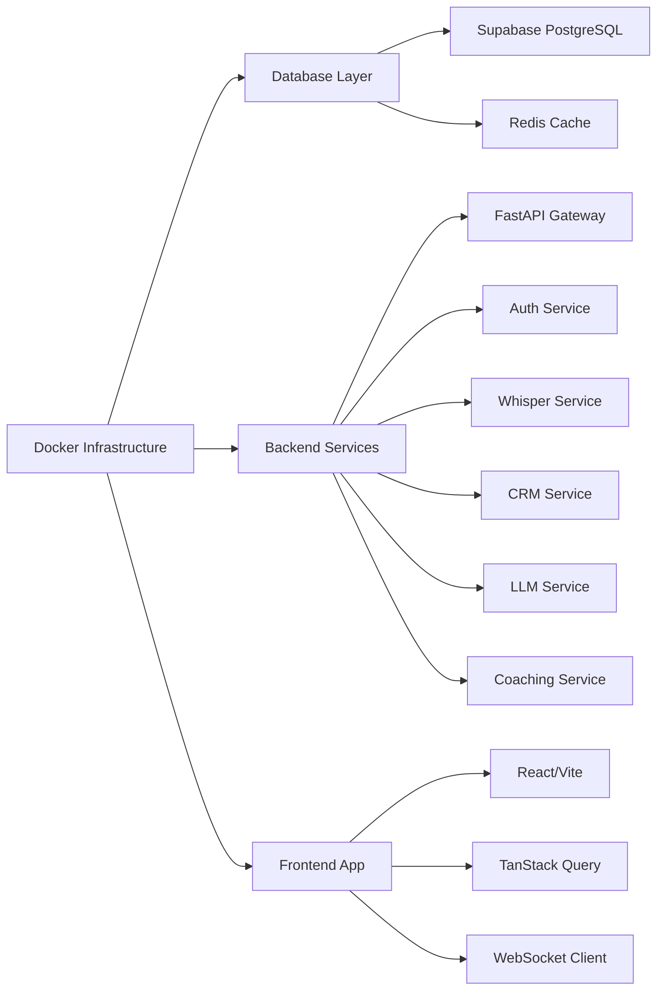
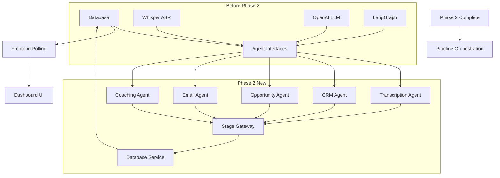
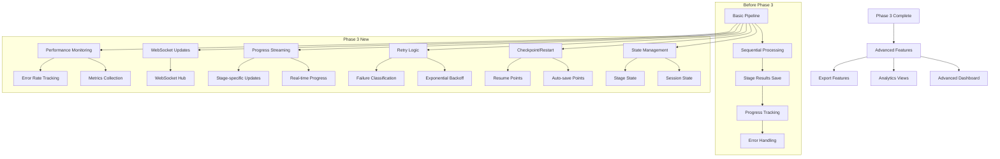
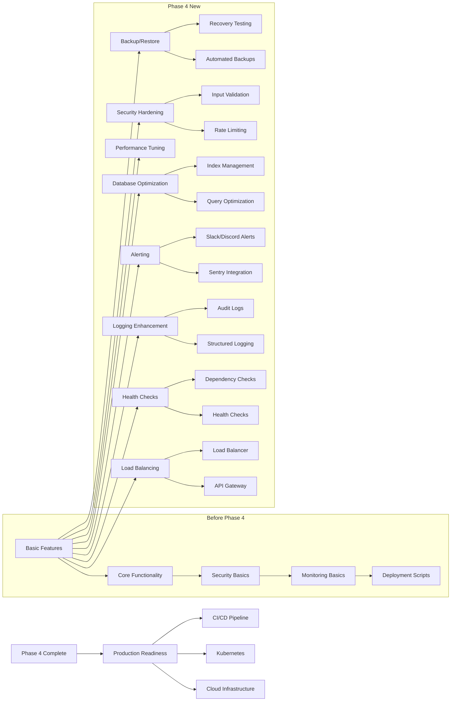

# DEPENDENCIES.md - Intelligent Sales Rep Assistant

## Phase 1: Foundation Dependencies

### Phase 1.1: Core Infrastructure

**Required Before Phase 2:**
- [ ] Docker Compose deployed
- [ ] Database schema initialized
- [ ] JWT + bcrypt auth working
- [ ] RBAC implemented
- [ ] Demo users seeded
- [ ] Environment variables configured

## Phase 2: Pipeline Dependencies

### Phase 2.1: Agent Service Integration

**Required Before Phase 3:**
- [ ] All agent interfaces defined
- [ ] Whisper transcription working
- [ ] OpenAI LLM integration
- [ ] LangGraph workflow engine
- [ ] Database agent client functions
- [ ] Basic pipeline orchestration

## Phase 3: Enhanced Pipeline Features

### Phase 3.1: Advanced Pipeline Capabilities

**Required Before Phase 4:**
- [ ] Agent state management implemented
- [ ] Checkpoint/restore functionality
- [ ] Exponential backoff retry logic
- [ ] Real-time progress streaming
- [ ] WebSocket communication layer
- [ ] Performance monitoring
- [ ] Advanced error classification

## Phase 4: Production Features

### Phase 4.1: Production Hardening

**Required Before Launch:**
- [ ] Load balancing and scaling
- [ ] Comprehensive health checks
- [ ] Structured logging and audit trails
- [ ] Error tracking and alerting
- [ ] Database optimization
- [ ] Performance tuning
- [ ] Security hardening
- [ ] Backup and recovery
- [ ] Cloud deployment setup
- [ ] CI/CD pipeline automation

## Implementation Dependencies Summary

### Matrix: What Must Be In Place Before What

| Feature | Prerequisites | Dependencies |
|---------|---------------|--------------|
| Trans Transcription | Docker + Auth | Database, Whisper API |
| CRM Extraction | Basic Pipeline | LLM API, Database |
| Opportunity Analysis | CRM Stage | LLM API, CRM Data |
| Email Generation | Opportunity | LLM API, Call Context |
| Coaching Feedback | Email Stage | LLM API, Performance Metrics |
| Checkpoint/Restart | State Mgmt | Database, Session ID |
| Retry Logic | Exponential Backoff | State Mgmt, Error Handling |
| WebSocket Updates | Progress Streaming | WS Hub, Frontend |
| Performance Monitoring | Metrics Collection | Database, Error Tracking |

### Critical Path

1. **Week 1**: Core pipeline + basic auth + database seed
2. **Week 2**: Enhanced pipeline + error handling + WebSocket
3. **Week 3**: Production features + monitoring + deployment
4. **Week 4**: Final hardening + testing + production launch

**Key Blocking Items:**
- [ ] Whisper API key configuration
- [ ] OpenAI API key configuration  
- [ ] Supabase credentials
- [ ] SSL certificates
- [ ] Domain/DNS setup
- [ ] Monitoring service credentials

**Risk Mitigation:**
- Local Whisper fallback for transcription
- API retry with exponential backoff
- Database connection pooling
- Circuit breaker patterns for external APIs
- Comprehensive logging for debugging

This dependency graph ensures that each phase builds upon a solid foundation and prevents building features that cannot work without their prerequisites in place.