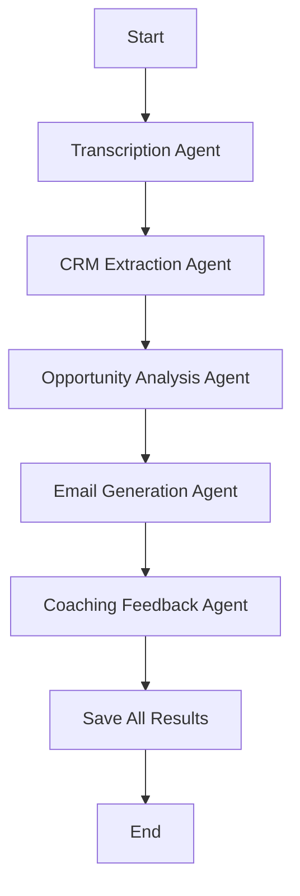

# SPEC.md - Intelligent Sales Rep Assistant Specification

## 1. Overview

This specification defines the requirements for the Intelligent Sales Rep Assistant - a 5-stage AI pipeline system that automates post-call sales workflows through transcription, CRM updates, opportunity analysis, email generation, and sales coaching.

## 2. Data Model

### 2.1 Core Entities

```json
{
  "call_sessions": {
    "call_id": "uuid",
    "user_id": "uuid",
    "audio_file_name": "string",
    "status": "string",
    "created_at": "datetime",
    "transcript": "object",
    "crm_record": "object",
    "opportunity_report": "object",
    "email_draft": "object",
    "coaching_report": "object",
    "error_message": "string"
  },
  
  "transcripts": {
    "id": "uuid",
    "call_id": "uuid (FK)",
    "audio_file_name": "string",
    "full_text": "text",
    "segments": "array",
    "speaker_identification": "boolean",
    "duration_seconds": "number",
    "confidence_score": "number"
  },
  
  "crm_records": {
    "id": "uuid",
    "call_id": "uuid (FK)",
    "contact_name": "string",
    "contact_email": "string",
    "company": "string",
    "deal_stage": "string",
    "pain_points": "array",
    "next_steps": "string",
    "call_date": "date",
    "last_updated": "datetime"
  },
  
  "opportunity_reports": {
    "id": "uuid",
    "call_id": "uuid (FK)",
    "buying_signals": "array",
    "deal_size": "number",
    "time_sensitivity": "string",
    "opportunity_flags": "array",
    "recommendations": "array"
  },
  
  "email_drafts": {
    "id": "uuid",
    "call_id": "uuid (FK)",
    "subject": "string",
    "body": "text",
    "recipient": "string",
    "sentiment": "string",
    "next_action": "string"
  },
  
  "coaching_reports": {
    "id": "uuid",
    "call_id": "uuid (FK)",
    "rubric_scores": "array",
    "talk_ratio_rep": "number",
    "talk_ratio_customer": "number",
    "strengths": "array",
    "areas_to_improve": "array",
    "recommended_actions": "array"
  },
  
  "users": {
    "id": "uuid",
    "email": "string (unique)",
    "name": "string",
    "role": "enum (admin|manager|rep)",
    "password_hash": "string",
    "created_at": "datetime"
  }
}
```

### 2.2 Relationships

- **call_sessions** → **users** (one-to-many, nullable for legacy sessions)
- **call_sessions** → **transcripts** (one-to-one)
- **call_sessions** → **crm_records** (one-to-one)
- **call_sessions** → **opportunity_reports** (one-to-one)
- **call_sessions** → **email_drafts** (one-to-one)
- **call_sessions** → **coaching_reports** (one-to-one)
- **users** → **users** (self-reference for hierarchy)

## 3. API Contracts

### 3.1 Authentication Endpoints

```http
POST /api/auth/login
Body: { "email": "string", "password": "string" }
Response: { "token": "string", "user": { "id": "string", "email": "string", "name": "string", "role": "string" } }

GET /api/auth/me
Headers: { "Authorization": "Bearer {token}" }
Response: { "id": "string", "email": "string", "name": "string", "role": "string" }

GET /api/auth/users
Headers: { "Authorization": "Bearer {token}" }
Response: [ { "id": "string", "email": "string", "name": "string", "role": "string" } ]

POST /api/auth/users
Headers: { "Authorization": "Bearer {token}" }
Body: { "email": "string", "password": "string", "name": "string", "role": "string" }
Response: { "id": "string", "email": "string", "name": "string", "role": "string" }

PATCH /api/auth/users/{id}
Headers: { "Authorization": "Bearer {token}" }
Body: { "name": "string", "role": "string" }
Response: { "id": "string", "email": "string", "name": "string", "role": "string" }

DELETE /api/auth/users/{id}
Headers: { "Authorization": "Bearer {token}" }
Response: 204
```

### 3.2 Pipeline Endpoints

```http
POST /api/pipeline/run
Headers: { "Authorization": "Bearer {token}" }
FormData: { "audio_file": "multipart/form-data" }
Response: { "call_id": "string", "status": "started", "message": "Processing began" }

GET /api/pipeline/{call_id}/status
Headers: { "Authorization": "Bearer {token}" }
Response: { "call_id": "string", "status": "string", "current_stage": "string", "stage_progress": "number" }

GET /api/pipeline/{call_id}/result
Headers: { "Authorization": "Bearer {token}" }
Response: { "transcript": { ... }, "crm_record": { ... }, "opportunity_report": { ... }, "email_draft": { ... }, "coaching_report": { ... } }

PATCH /api/pipeline/{call_id}/crm
Headers: { "Authorization": "Bearer {token}" }
Body: { "contact_name": "string", "contact_email": "string", "company": "string", "deal_stage": "string", "pain_points": [], "next_steps": "string", "call_date": "date" }
Response: { "id": "string", "contact_name": "string", "contact_email": "string", "company": "string", "deal_stage": "string", "pain_points": [], "next_steps": "string", "call_date": "date", "last_updated": "datetime" }

PATCH /api/pipeline/{call_id}/email
Headers: { "Authorization": "Bearer {token}" }
Body: { "subject": "string", "body": "string" }
Response: { "id": "string", "subject": "string", "body": "string", "recipient": "string", "sentiment": "string", "next_action": "string" }
```

### 3.3 Session Management

```http
GET /api/sessions
Headers: { "Authorization": "Bearer {token}" }
Response: [ { "call_id": "string", "audio_file_name": "string", "user_id": "string", "status": "string", "created_at": "datetime", "current_stage": "string" } ]
```

### 3.4 Error Responses

```json
{
  "error": {
    "message": "string",
    "code": "string",
    "status_code": "number"
  }
}
```

## 4. Agent Specifications

### 4.1 Transcript Agent

**Purpose**: Speech-to-text conversion with speaker identification
**Input**: Audio file blob, call_id
**Output**: { "full_text": "string", "segments": [], "duration_seconds": number, "speaker_identification": boolean }
**Dependencies**: Whisper ASR service
**Tools**: whisper.py, API client fallback

### 4.2 CRM Agent

**Purpose**: Extract contact details and deal information from transcript
**Input**: { "full_text": "string", "speaker_identification": boolean }
**Output**: { "contact_name": "string", "contact_email": "string", "company": "string", "deal_stage": "string", "pain_points": [], "next_steps": "string", "call_date": "date" }
**Dependencies**: OpenAI LLM service
**Tools**: LLM client, context extraction prompts

### 4.3 Opportunity Agent

**Purpose**: Analyze buying signals and identify upsell opportunities
**Input**: { "full_text": "string", "crm_data": { ... } }
**Output**: { "buying_signals": [], "deal_size": number, "time_sensitivity": "string", "opportunity_flags": [], "recommendations": [] }
**Dependencies**: OpenAI LLM service
**Tools**: LLM client, opportunity analysis prompts

### 4.4 Email Agent

**Purpose**: Draft personalized follow-up emails based on call outcome
**Input**: { "transcript": { ... }, "crm_data": { ... }, "opportunity_report": { ... } }
**Output**: { "subject": "string", "body": "string", "recipient": "string", "sentiment": "string", "next_action": "string" }
**Dependencies**: OpenAI LLM service
**Tools**: LLM client, email drafting prompts

### 4.5 Coaching Agent

**Purpose**: Provide sales performance feedback and improvement recommendations
**Input**: { "transcript": { ... }, "coaching_metrics": { ... } }
**Output**: { "rubric_scores": [], "talk_ratio_rep": number, "talk_ratio_customer": number, "strengths": [], "areas_to_improve": [], "recommended_actions": [] }
**Dependencies**: OpenAI LLM service
**Tools**: LLM client, coaching evaluation prompts

## 5. LangGraph Workflow

### 5.1 Stage Flow



### 5.2 Error Handling

- Each stage has 3 retries with exponential backoff
- Failed stages trigger error propagation to UI
- Stage failures preserve call context for manual retry
- Fallback to default values when AI services unavailable

## 6. UI/UX Specifications

### 6.1 Dashboard Layout

```typescript
interface Dashboard {
  currentStep: number;
  completedSteps: Set<number>;
  selectedCallId: string | null;
  stepTransition: boolean;
  usersOpen: boolean;
  sessionsOpen: boolean;
  loading: boolean;
  error: string | null;
}
```

### 6.2 Stage Progress

Each stage shows:
- Stage icon and title
- Progress indicator (spinning → checkmark → grayed out)
- Live status updates
- Error messages with retry option
- Stage-specific data display

### 6.3 Responsive Design

- Desktop: Split-screen layout with sidebar navigation
- Tablet: Accordion-style stage navigation
- Mobile: Single-column, stage-swipe navigation
- Theme: Purple (#7c3aed), dark sidebar (#2d1b69), light gray bg (#f5f5f5)

## 7. Testing Requirements

### 7.1 Unit Tests

- **Backend**: 20+ tests covering auth, pipeline, database
- **Frontend**: React component tests for each stage
- **Integration**: End-to-end pipeline workflow tests
- **RBAC**: 33 role-based access control tests

### 7.2 Test Data

```json
{
  "users": [
    { "id": "admin", "email": "admin@example.com", "name": "Admin User", "role": "admin", "password": "admin123" },
    { "id": "manager", "email": "manager@example.com", "name": "Manager User", "role": "manager", "password": "manager123" },
    { "id": "rep1", "email": "rep1@example.com", "name": "Rep One", "role": "rep", "password": "rep123" },
    { "id": "rep2", "email": "rep2@example.com", "name": "Rep Two", "role": "rep", "password": "rep123" }
  ],
  
  "sessions": [
    { "call_id": "uuid", "user_id": "rep1", "audio_file_name": "demo1.wav", "status": "complete" },
    { "call_id": "uuid", "user_id": "rep2", "audio_file_name": "demo2.wav", "status": "complete" },
    { "call_id": "uuid", "user_id": null, "audio_file_name": "demo3.wav", "status": "complete" }
  ]
}
```

## 8. Performance Requirements

### 8.1 Response Times

- Audio upload: ≤ 2 seconds
- Stage processing: ≤ 60 seconds each
- Full pipeline: ≤ 5 minutes
- Database queries: ≤ 100ms

### 8.2 Concurrency

- Peak load: 10 simultaneous active pipeline executions
- Database connection pool: 20 connections
- API rate limit: 100 requests/minute per user

## 9. Security Requirements

### 9.1 Authentication

- JWT tokens with 7-day expiration
- Refresh tokens for session extension
- Password hashing with bcrypt (12 rounds)
- Secure password storage

### 9.2 Authorization

- Role-based access control (admin/manager/rep)
- Session ownership verification
- CRM/email editing permissions
- Admin-only user management

### 9.3 Data Protection

- HTTPS-only API endpoints
- Input validation and sanitization
- Database connection encryption
- Error handling without information leakage