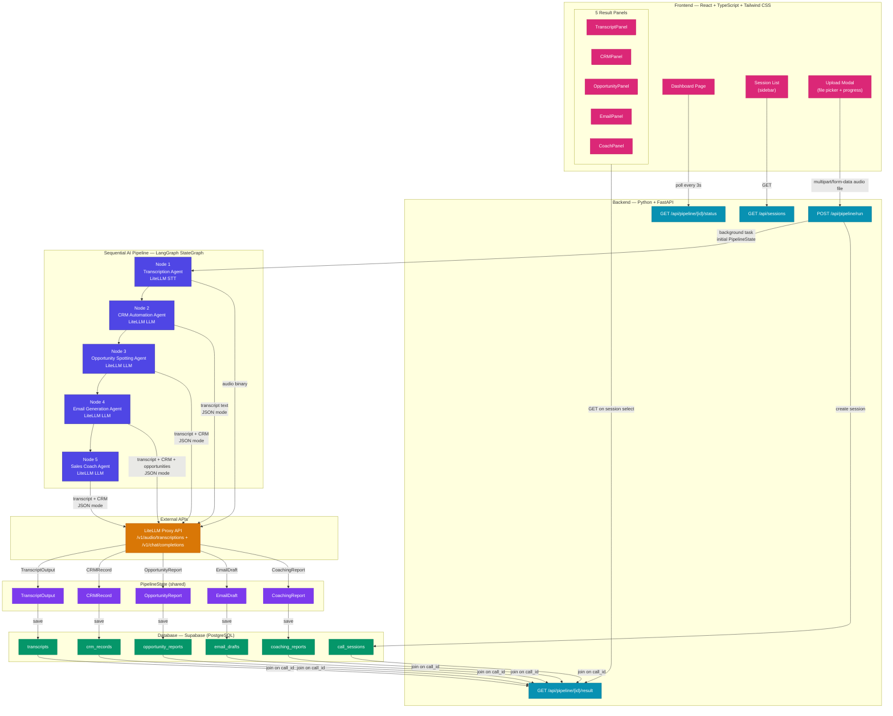
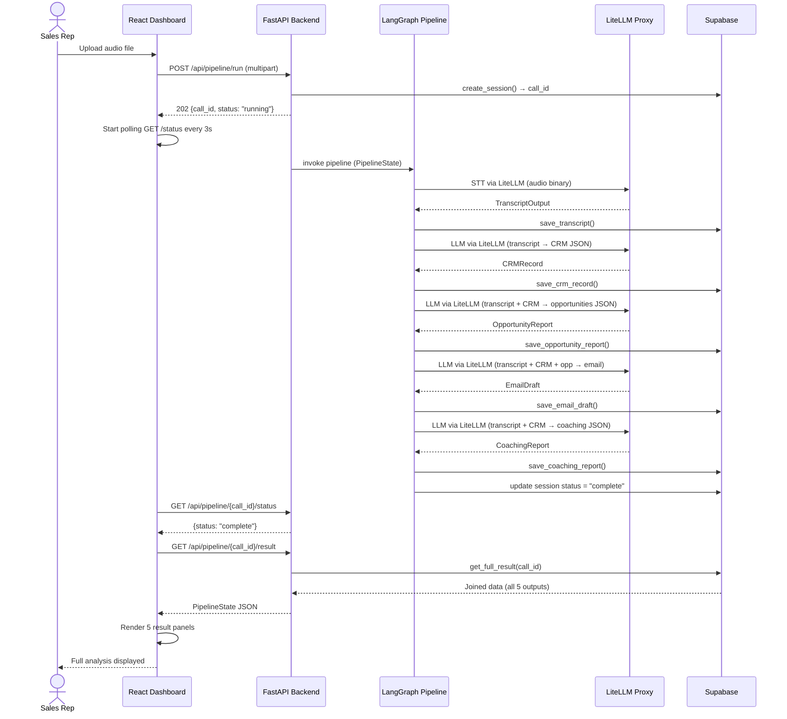

# docs/architecture.md — System Architecture

## Intelligent Sales Rep Assistant — In-Scope Architecture

> This diagram represents the **MVP in-scope architecture** only. See `FUTURE_VISION.md` for post-MVP additions.

---

## System Architecture Diagram

---

## Data Flow Sequence

---

## Component Responsibility Matrix

| Component | Responsibility | Does NOT do |
|---|---|---|
| React Dashboard | Display results; trigger uploads; poll status | Business logic; LLM calls |
| FastAPI Backend | Route handling; file temp storage; background tasks | LLM calls; direct DB writes in routes |
| LangGraph Pipeline | Orchestrate agent sequence; manage PipelineState | HTTP handling; direct DB writes (delegates to CRUD) |
| LangChain Agents | Call LLM; parse response; validate schema | Orchestration; DB operations |
| Supabase CRUD Layer | All database reads/writes | Business logic; LLM calls |
| Pydantic Schemas | Data contracts between all layers | Persistence; HTTP logic |
